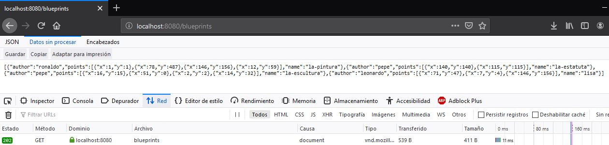
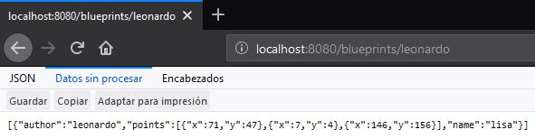
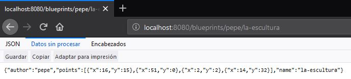
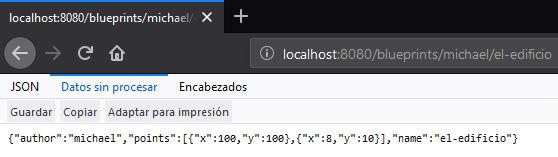

## Compile and run instructions
En el directorio `BLUEPRINTS-PART2`:
* **Para compilar:** Ejecutar `mvn package`.
* **Para empezar el servidor:** Ejecutar `mvn spring-boot:run`.
* **Para ejecutar pruebas:** Ejectuar `mvn test`.
## Part I
* *Integrate to the base project supplied the Beans developed in the previous exercise. Just copy the classes, NOT the configuration files. Rectify that the dependency injection scheme is correctly configured with the* `@Service` *and* `@Autowired` *annotations.*

    Se integraron las clases del laboratorio pasado y se verificó la correcta inyección de dependencias.

* *Modify the persistence bean* `InMemoryBlueprintPersistence` *so that by default it is initialized with at least three other planes, and with two associated with the same author.*

    Clase `InMemoryBlueprintPersistence`
    ```java
    @Component("InMemoryBlueprintPersistence")
    public class InMemoryBlueprintPersistence implements BlueprintsPersistence {
        public InMemoryBlueprintPersistence() {
            //load stub data
            Point[] pts = new Point[]{new Point(140, 140), new Point(115, 115)};
            Point[] pts1 = new Point[]{new Point(1, 1), new Point(78, 487), new Point(12, 59), new Point(146, 156)};
            Point[] pts2 = new Point[]{new Point(2, 2), new Point(51, 0), new Point(14, 32), new Point(16, 15)};
            Point[] pts3 = new Point[]{new Point(7, 4), new Point(71, 47), new Point(146, 156)};
            Blueprint bp = new Blueprint("pepe", "la-estatuta", pts);
            Blueprint bp1 = new Blueprint("ronaldo", "la-pintura", pts1);
            Blueprint bp2 = new Blueprint("pepe", "la-escultura", pts2);
            Blueprint bp3 = new Blueprint("leonardo", "lisa", pts3);

            blueprints.put(new Tuple<>(bp.getAuthor(), bp.getName()), bp);
            blueprints.put(new Tuple<>(bp1.getAuthor(), bp1.getName()), bp1);
            blueprints.put(new Tuple<>(bp2.getAuthor(), bp2.getName()), bp2);
            blueprints.put(new Tuple<>(bp3.getAuthor(), bp3.getName()), bp3);
        }
    }
    ```

* *Configure your application to offer the resource* /blueprints, *so that when a* `GET` *request is made, return in* `JSON` *format - all the drawings. For this:*
     * *Modify the* `BlueprintAPIController` *class taking into account the following example of a REST controller made with SpringMVC/SpringBoot*

    * *Have the* `BlueprintServices` *type bean injected into this class (which, in turn, will be injected with its persistence and point filtering dependencies).*

    Clase `BlueprintAPIController`
    ```java
    @RestController
    @RequestMapping(value = "/blueprints")
    public class BlueprintAPIController {

        @Autowired
        BlueprintsServices blueprintsServices;

        @RequestMapping(method = RequestMethod.GET)
        public ResponseEntity<?> manejadorGetRecursoBlueprint() {
            Set<Blueprint> data = null;
            try{
                data = blueprintsServices.getAllBlueprints();
            }catch (Exception ex){
                return new ResponseEntity<>("ERROR 500",HttpStatus.INTERNAL_SERVER_ERROR);
            }
            return new ResponseEntity<>(data, HttpStatus.ACCEPTED);
        }
    }
    ```


* *Verify the operation of the application by launching the application with maven. And then sending a* `GET` *request to: http://localhost:8080/blueprints. Rectify that, in response, a* `JSON` *object is obtained with a list containing the detail of the drawings provided by default, and that the corresponding point filtering has been applied.*

    De la siguiente imagen se puede apreciar que el filtro fue aplicado y se obtienen todas las blueprints en un objeto JSON.

    

* *Modify the controller so that it now accepts* `GET` *requests to the resource* `/blueprints/{author}`*, which returns using a* `JSON` *representation all the plans made by the author whose name is* `{author}`*. If there is no such author, you must respond with the HTTP error code 404. For this, review in the Spring documentation, section 22.3.2, the use of* `@PathVariable`*. Again, verify that when making a* `GET` *request -for example- to the resource http://localhost:8080/blueprints/juan, the set of planes associated with the author 'juan' is obtained in* `JSON` *format (adjust this to the names of author used in point 2)*

    Clase `BlueprintAPIController`
    ```java
    @RestController
    @RequestMapping(value = "/blueprints")
    public class BlueprintAPIController {

        @Autowired
        BlueprintsServices blueprintsServices;

        @RequestMapping(method = RequestMethod.GET, path = "{author}")
        public ResponseEntity<?> manejadorGetRecursoBlueprintAutor(@PathVariable("author") String authorName) {
            Set<Blueprint> data = null;
            try {
                data = blueprintsServices.getBlueprintsByAuthor(authorName);
            } catch (BlueprintNotFoundException e) {
                return new ResponseEntity<>("ERROR 404",HttpStatus.NOT_FOUND);
            }
            return new ResponseEntity<>(data, HttpStatus.ACCEPTED);
        }
    }
    ```
    La imagen muestra su funcionamiento.
    
    

* *Modify the controller so that it now accepts* `GET` *requests to the resource* `/blueprints/{author}/{bpname}` *, which returns using a* `JSON` *representation only ONE plane, in this case the one made by* `{author}` *and whose name is* `{bpname}`*. Again, if there is no such author, you must respond with the HTTP 404 error code.*

    Clase `BlueprintAPIController`
    ```java
    @RestController
    @RequestMapping(value = "/blueprints")
    public class BlueprintAPIController {

        @Autowired
        BlueprintsServices blueprintsServices;

        @RequestMapping(method = RequestMethod.GET, path = "{author}/{bpname}")
        public ResponseEntity<?> manejadorGetRecursoBlueprintAutor(@PathVariable("author") String authorName, @PathVariable("bpname") String bpName) {
            Blueprint data = null;
            try {
                data = blueprintsServices.getBlueprint(authorName,bpName);
            } catch (BlueprintNotFoundException e) {
                return new ResponseEntity<>("ERROR 404",HttpStatus.NOT_FOUND);
            }
            return new ResponseEntity<>(data, HttpStatus.ACCEPTED);
        }
    }
    ```
    La imagen muestra su funcionamiento.

    

## PART II
* *Add the handling of* `POST` *requests (creation of new plans), so that an http client can register a new order by making a* `POST` *request to the resource planes, and sending as content of the request all the detail of said resource through a* `JSON` *document. For this, consider the following example, which considers - by consistency with the HTTP protocol - the handling of HTTP status codes (in case of success or error):*

    Clase `BlueprintAPIController`
    ```java
    @RestController
    @RequestMapping(value = "/blueprints")
    public class BlueprintAPIController {

        @Autowired
        BlueprintsServices blueprintsServices;
        
        @RequestMapping(method = RequestMethod.POST)
        public ResponseEntity<?> newBlueprint(@RequestBody Blueprint b ) {
            try {
                blueprintsServices.addNewBlueprint(b);
                return new ResponseEntity<>(HttpStatus.CREATED);
            } catch (BlueprintPersistenceException e) {
                return new ResponseEntity<>("ERROR 403",HttpStatus.FORBIDDEN);
            }
        }
    }
    ```
* *To test that the planes resource correctly accepts and interprets* `POST` *requests, use the Unix* `curl` *command. This command has as a parameter the type of content handled (in this case*`JSON`)*, and the message body that will go with the request, which in this case must be a* `JSON` *document equivalent to the Client class (where instead of *`{JSON Object}`*, a* `JSON` *object corresponding to a new order will be used.*

    Se ejecutó el siguiente comando:
    ```bash
    $ curl -i -X POST -HContent-Type:application/json -HAccept:application/json http://localhost:8080/blueprints/ -d '{"author":"michael","points":[{"x":8,"y":10},{"x":100,"y":100}],"name":"el-edificio"}'
    ```
* *Taking into account the author and name of the registered plan, verify that it can be obtained through a* `GET` *request to the corresponding resource* `/blueprints/{author}/{bpname}`

    La imagen muestra su funcionamiento.

    

* *Add support to the* `PUT` *verb for resources of the form* `/blueprints/{author}/{bpname}`*, so that it is possible to update a specific plane.*

    Clase `BlueprintAPIController`
    ```java
    @RestController
    @RequestMapping(value = "/blueprints")
    public class BlueprintAPIController {

        @Autowired
        BlueprintsServices blueprintsServices;

        @RequestMapping(method = RequestMethod.PUT, path = "{author}/{bpname}")
        public ResponseEntity<?> putBlueprint(
            @RequestBody Blueprint b,
            @PathVariable("author") String authorName,
            @PathVariable("bpname") String bpName)
        {
            try {
                blueprintsServices.update(b, authorName, bpName);
                return new ResponseEntity<>(HttpStatus.CREATED);
            } catch (BlueprintNotFoundException e) {
                return new ResponseEntity<>("ERROR 403",HttpStatus.FORBIDDEN);
            }
        }
    }
    ```
## Part III
*The* `BlueprintsRESTAPI` *component will work in a concurrent environment. That is, it will attend multiple requests simultaneously (with the stack of applications used, these requests will be attended by default across multiple threads). Given the above, you should review your API (once it works), and identify:*
  * *What race conditions could occur?*
  * *What are the respective critical regions?*
  
*Set the code to suppress race conditions. Keep in mind that simply synchronizing access to persistence/query operations will significantly degrade the API performance, so you should look for alternative strategies.*

Realizado en ANALISIS_CONCURRENCIA.txt
